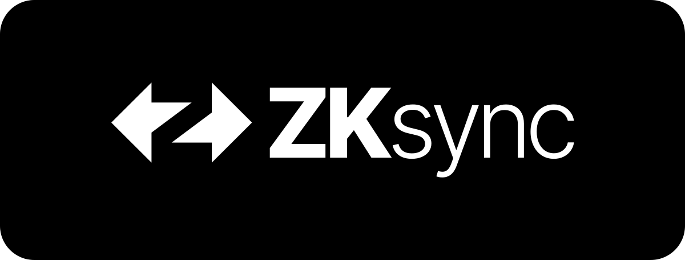

# ZKsync Contracts

This package contains ZKsync L1, L2 and System Contracts. For more details see the [source repository](https://github.com/matter-labs/era-contracts).

## License

ZKsync Contracts are distributed under the terms of the MIT license.

See [LICENSE-MIT](LICENSE-MIT) for details.

## Official Links

- [Website](https://zksync.io)
- [GitHub](https://github.com/matter-labs)
- [ZK Credo](https://github.com/zksync/credo)
- [X](https://x.com/zksync)
- [X for Devs](https://x.com/zksyncdevs)
- [Discord](https://join.zksync.dev)
- [Mirror](https://zksync.mirror.xyz)
